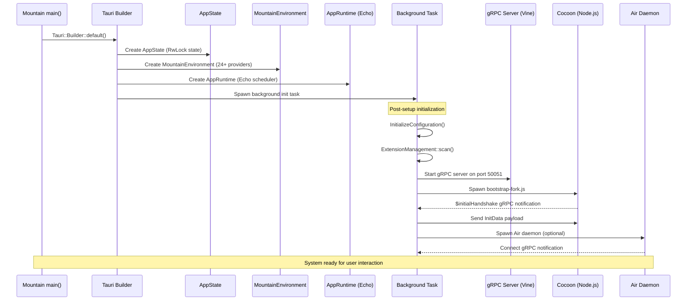

# Mountain: Native Backend Application&#x2001;🏔️

`Mountain` is the primary `Tauri` application and native `Rust` backend for the
`Land` code editor. `Mountain`:

- Implements every abstract trait from `Common`
- Hosts the `gRPC` server
- Manages application state
- Dispatches `Tauri` commands
- Orchestrates sidecar processes

---

## Table of Contents

1. [Overview](#overview)
2. [Application Lifecycle](#application-lifecycle)
3. [Module Architecture](#module-architecture)
4. [ApplicationState](#applicationstate)
5. [Environment and Providers](#environment-and-providers)
6. [Tauri Command System](#tauri-command-system)
7. [gRPC Service (Vine)](#grpc-service-vine)
8. [Process Management](#process-management)
9. [IPC and Event System](#ipc-and-event-system)
10. [Cache System](#cache-system)
11. [Extension Management](#extension-management)
12. [Related Documentation](#related-documentation)

---



## Overview&#x2001;📋

`Mountain` is a `Rust` binary built with `Tauri` v2 and `tonic` `gRPC`:

- It is the single native process that owns all OS-level capabilities (file
  system, terminal PTY, clipboard, dialogs)
- It coordinates the `Cocoon` extension host and `Air` background daemon

| Attribute    | Value                                                                                                                             |
| ------------ | --------------------------------------------------------------------------------------------------------------------------------- |
| Language     | `Rust` (edition 2024)                                                                                                             |
| Framework    | `Tauri` v2                                                                                                                        |
| gRPC         | `tonic` + `prost`                                                                                                                 |
| Dependencies | `Common`, `Echo`, `Mist`, `tauri`, `tauri-plugin-dialog`, `tauri-plugin-fs`, `tonic`, `prost`, `keyring`, `portable-pty`, `tokio` |
| Sidecars     | `Cocoon` (`Node.js`), `Air` (`Rust` daemon)                                                                                       |

---

## Application Lifecycle&#x2001;🔄

### Startup Sequence&#x2001;🚀

```
fn main()
    |
    v
1. Tauri::Builder::default() created
    |
    v
2. .setup(|app| {
    a. Create AppState (thread-safe state container)
    b. Create MountainEnvironment (implements all Common traits)
    c. Create AppRuntime (Echo-backed execution engine)
    d. Spawn tokio background task for post-setup init
    e. Return Ok(())
   })
    |
    v
3. Post-setup background task:
    |
    +---> InitializeConfiguration()
    |       - Read settings.json files from disk
    |       - Populate AppState with configuration values
    |
    +---> ExtensionManagement::scan()
    |       - Walk extension directories
    |       - Load and validate extension manifests
    |       - Populate AppState extension registry
    |
    +---> Vine::server::Initialize()
    |       - Start gRPC server on NetworkMountainPort (default: 50051)
    |
    +---> InitializeCocoon()
    |       - Spawn Node.js bootstrap-fork.js
    |       - Wait for $initialHandshake gRPC notification
    |       - Send initExtensionHost with InitData payload
    |
    v
4. System ready for user interaction
```

### Shutdown Sequence&#x2001;🛑

```
1. Tauri window close requested
2. SIGTERM sent to Cocoon sidecar (graceful, 5s timeout)
3. SIGTERM sent to Air sidecar (if running)
4. AppState persisted (settings, window state)
5. gRPC server gracefully drained (in-flight requests complete)
6. Echo scheduler shutdown (in-flight tasks complete)
7. Tokio runtime shutdown
8. Process exits
```

---

## Module Architecture&#x2001;🗺️

```
Element/Mountain/Source/
+-- Binary/
|   +-- Main/
|   |   +-- Entry.rs          - fn main(), Tauri builder
|   |   +-- Setup.rs          - .setup() hook
|   |   +-- Shutdown.rs       - Graceful shutdown
|   |   +-- Tray.rs           - System tray icon
|   |   +-- IPC/              - IPC handler registration
|   |   +-- Register/         - Command registration
|   |   +-- Initialize/       - Startup initialization
|   |   +-- Debug/            - Debug build utilities
|   |   +-- Service/          - Service layer initialization

+-- ApplicationState/
|   +-- State.rs              - Central state struct
|   +-- Internal/             - Internal state management
|   +-- DTO/                  - State transfer objects

+-- Environment/
|   +-- MountainEnvironment.rs - Common trait implementations
|   +-- CommandProvider.rs     - Command execution provider
|   +-- ConfigurationProvider/ - Configuration provider
|   +-- FileSystemProvider/    - File system provider
|   +-- TerminalProvider.rs    - Terminal PTY provider
|   +-- ... (24+ providers)

+-- Vine/ (gRPC)
|   +-- Server/               - gRPC server (tonic)

+-- ProcessManagement/
|   +-- CocoonManagement.rs    - Cocoon sidecar lifecycle
|   +-- InitializationData.rs  - Startup payload construction
|   +-- NodeResolver/          - Node.js binary resolution

+-- IPC/ (Tauri)
|   +-- TauriIPCServer.rs      - Tauri IPC server
|   +-- WindServiceHandlers/   - Wind-specific handlers
|   +-- WindAdvancedSync/      - Sync handlers
|   +-- DevLog/                - Developer logging

+-- RPC/ (Internal dispatch)
|   +-- CocoonService/         - Cocoon gRPC service implementation

+-- RunTime/
|   +-- ApplicationRunTime/    - Effect execution engine
|   +-- Execute/               - Effect execution
|   +-- Shutdown/              - Runtime shutdown

+-- Command/                   - Command implementation
+-- Track/                     - Request tracking
+-- ExtensionManagement/       - Extension lifecycle
+-- FileSystem/                - File system operations
+-- Workspace/                 - Workspace management
+-- LandFixTier.rs             - Runtime tier banner
+-- Library.rs                 - Library root
```

---

## ApplicationState&#x2001;📦

The central state container managed by `Tauri`:

```rust
pub struct AppState {
    configuration: RwLock<ConfigurationMap>,
    extensions: RwLock<ExtensionRegistry>,
    workspaces: RwLock<WorkspaceManager>,
    // ... additional state domains
}
```

| State Domain   | Access Pattern                      | Persistence              |
| -------------- | ----------------------------------- | ------------------------ |
| Configuration  | `RwLock<HashMap>`                   | `settings.json` on disk  |
| Extensions     | `RwLock<Vec<Manifest>>`             | Scan on startup          |
| Workspaces     | `RwLock<Vec<Workspace>>`            | Window state on shutdown |
| Active editors | `RwLock<HashMap<URI, EditorState>>` | Transient                |

- State is accessed through `Tauri`'s `State<AppState>` managed type
- Available in every command handler

---

## Environment and Providers&#x2001;🧩

`MountainEnvironment` implements every trait from `Common`. Each capability has
a dedicated Provider:

| Provider                     | Common Trait                 | Implementation                  |
| ---------------------------- | ---------------------------- | ------------------------------- |
| `FileSystemProvider`         | `FileSystem`                 | tokio::fs native operations     |
| `ConfigurationProvider`      | `Configuration`              | JSON file read/write with merge |
| `TerminalProvider`           | `Terminal`                   | portable-pty PTY management     |
| `UserInterfaceProvider`      | `UserInterface`              | tauri-plugin-dialog             |
| `CommandProvider`            | `CommandExecutor`            | Command registry + dispatch     |
| `DocumentProvider`           | `Document`                   | Text model management           |
| `ExtensionManagementService` | `ExtensionManagementService` | VSIX install + manifest scan    |
| `SearchProvider`             | `Search`                     | ripgrep-based search            |
| `SecretProvider`             | `Secret`                     | OS keyring (keyring crate)      |
| `StorageProvider`            | `Storage`                    | JSON file key-value             |
| `WorkspaceProvider`          | `Workspace`                  | Folder management               |
| `IPCProvider`                | `IPC`                        | gRPC proxy to Cocoon            |

### Provider Registration&#x2001;📝

```rust
impl MountainEnvironment {
    pub fn new(app_state: AppState) -> Self {
        Self {
            file_system: Arc::new(FileSystemProvider::new(app_state.clone())),
            configuration: Arc::new(ConfigurationProvider::new(app_state.clone())),
            terminal: Arc::new(TerminalProvider::new()),
            // ... all 24+ providers
        }
    }
}
```

---

## Tauri Command System&#x2001;⌨️

`Mountain` registers `Tauri` commands as typed `Rust` handlers:

```rust
#[tauri::command]
async fn read_file(
    path: String,
    state: State<'_, AppState>,
) -> Result<Vec<u8>, String> {
    let fs = state.file_system();
    fs.read_file(Path::new(&path))
        .await
        .map_err(|e| e.to_string())
}
```

### Registered Command Categories

| Category      | Example Commands                                 | Handler                    |
| ------------- | ------------------------------------------------ | -------------------------- |
| File System   | read_file, write_file, stat, readdir             | FileSystemProvider         |
| Configuration | get_configuration, set_configuration             | ConfigurationProvider      |
| Terminal      | create_terminal, write_terminal, resize_terminal | TerminalProvider           |
| Dialog        | open_dialog, save_dialog, show_message           | UserInterfaceProvider      |
| Clipboard     | get_clipboard, set_clipboard                     | Clipboard                  |
| Extension     | install_extension, list_extensions               | ExtensionManagementService |
| Search        | search_files, search_text                        | SearchProvider             |
| Window        | set_window_size, focus_window                    | Window management          |
| Lifecycle     | quit, restart                                    | Process management         |

---

## gRPC Service (Vine)&#x2001;🌐

`Mountain` hosts the `Vine` `gRPC` server for `Cocoon` and `Air` communication.

### Server Configuration&#x2001;⚙️

```rust
// Server listens on NetworkMountainPort (default: 50051)
let addr = format!("127.0.0.1:{}", config.network_mountain_port)
    .parse()
    .expect("Invalid gRPC address");

Server::builder()
    .add_service(ExtensionHostServer::new(service_impl))
    .add_service(BackgroundServicesServer::new(background_impl))
    .serve(addr)
    .await?;
```

### Service Handlers&#x2001;📋

| Service       | RPC                | Handler Module                            |
| ------------- | ------------------ | ----------------------------------------- |
| ExtensionHost | Initialize         | `ProcessManagement/InitializationData.rs` |
| ExtensionHost | ExecuteCommand     | `RPC/CocoonService/Command/`              |
| ExtensionHost | ProvideHover       | `RPC/CocoonService/Provider/`             |
| ExtensionHost | CreateWebviewPanel | `RPC/CocoonService/Window/`               |
| ExtensionHost | HealthCheck        | `Vine/Server/`                            |

---

## Process Management&#x2001;⚙️

### Cocoon Management&#x2001;🔄

The `CocoonManagement` module handles the `Cocoon` sidecar lifecycle:

1. **Environment construction**: Sets `PATH`, `VSCODE_PARENT_PID`, tier env vars
2. **Process spawn**: `std::process::Command` spawns `node bootstrap-fork.js`
3. **Health monitoring**: `gRPC` heartbeat (5s interval, 3 miss timeout)
4. **Crash recovery**: Up to 3 automatic restarts with exponential backoff
5. **Graceful shutdown**: `SIGTERM`, 5s timeout, `SIGKILL` on timeout

### Air Management&#x2001;🔄

The `AirManagement` module handles `Air` sidecar lifecycle:

1. **Process spawn**: Spawns `Air` binary with configured data directory
2. **gRPC connection**: Connects to `Air` on port 50053
3. **Service registration**: `Air` reports available services (updater, indexer,
   etc.)
4. **Health monitoring**: Bidirectional heartbeat
5. **Coordination**: `Mountain` dispatches background work via `PerformAction`

---

## IPC and Event System&#x2001;📡

`Mountain` pushes events to `Wind`/`Sky` via `Tauri`'s event system:

```rust
// Emit configuration change event
app_handle.emit("configuration-changed", serde_json::json!({
    "keys": ["editor.fontSize", "workbench.colorTheme"]
})).ok();
```

### Event Catalog

| Event                   | Payload                          | Trigger              |
| ----------------------- | -------------------------------- | -------------------- |
| `configuration-changed` | `{ keys: string[] }`             | Configuration save   |
| `extension-activated`   | `{ id: string }`                 | Extension activation |
| `terminal-data`         | `{ id: number, data: string }`   | PTY output           |
| `file-changed`          | `{ path: string, type: string }` | File watcher         |
| `theme-changed`         | `{ theme: string }`              | Theme switch         |
| `window-state-changed`  | `{ state: string }`              | Window resize/move   |

---

## Cache System&#x2001;💾

`Mountain` implements two caching subsystems:

| Cache            | Purpose                     | Implementation                        |
| ---------------- | --------------------------- | ------------------------------------- |
| `AssetMemoryMap` | Asset file mmap caching     | Memory-mapped files with LRU eviction |
| `PathCanon`      | Path canonicalization cache | LRU cache of `realpath()` results     |

---

## Extension Management&#x2001;🧩

| Operation | Implementation                                             |
| --------- | ---------------------------------------------------------- |
| Scan      | Walk extension directories, parse `package.json` manifests |
| Install   | VSIX extraction to extension directory                     |
| Uninstall | Remove extension directory                                 |
| List      | Read extension registry from `AppState`                    |

---

## Related Documentation&#x2001;📚

- [Common](https://github.com/CodeEditorLand/Common/tree/Current/Documentation/GitHub/Architecture.md) -
  Abstract trait definitions
- [Echo](https://github.com/CodeEditorLand/Echo/tree/Current/Documentation/GitHub/Architecture.md) -
  Task scheduler integration
- [Mist](https://github.com/CodeEditorLand/Mist/tree/Current/Documentation/GitHub/Architecture.md) -
  DNS isolation
- [Air](https://github.com/CodeEditorLand/Air/tree/Current/Documentation/GitHub/Architecture.md) -
  Background daemon
- [Vine](https://github.com/CodeEditorLand/Vine/tree/Current/Documentation/GitHub/Architecture.md) -
  `gRPC` protocol definitions
- [BuildPipeline](https://github.com/CodeEditorLand/Land/tree/Current/Documentation/GitHub/BuildPipeline.md) -
  Build pipeline
- [InterComponentProtocol](https://github.com/CodeEditorLand/Land/tree/Current/Documentation/GitHub/InterComponentProtocol.md) -
  Protocol specification

---

## Shim Compatibility

| 🟠 Low-Level Shim                              | 🔵 Coverage Shim                   |
| ---------------------------------------------- | ---------------------------------- |
| Tier: `TierShim=Own\|Preempt`                  | Tier: `TierShim=Proxy\|Replace`    |
| Engine prototype hooks                         | Service routing + audit            |
| Error, Emitter, Cancel, Dispose, Async, Timing | IPC SwallowMap, DI proxy, AuditLog |

> This Element supports the Land deep-shim interception system. The shim
> intercepts VS Code engine events at both the JavaScript prototype level (🟠
> orange) and the application service level (🔵 blue). Gated behind `TierShim`
> env var (default: `None` - zero overhead). See the
> [Shim documentation](/doc/low-level-shim).

**Shim Modules:** `Source/Shim/` contains the Rust-side SwallowMap
implementation.

---

**Project Maintainers:** Source Open
([Source/Open@Editor.Land](mailto:Source/Open@Editor.Land)) |
[GitHub Repository](https://github.com/CodeEditorLand/Mountain) |
[Report an Issue](https://github.com/CodeEditorLand/Mountain/issues)
