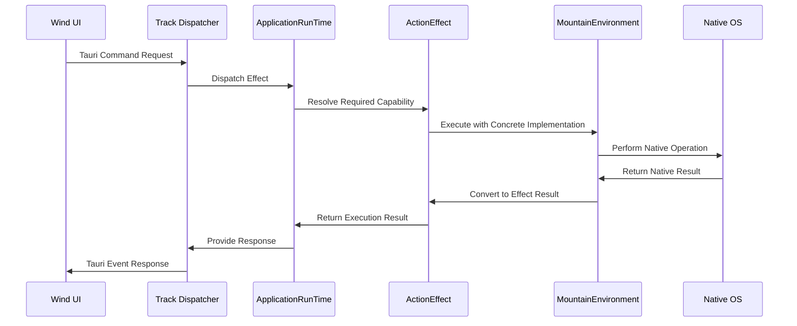
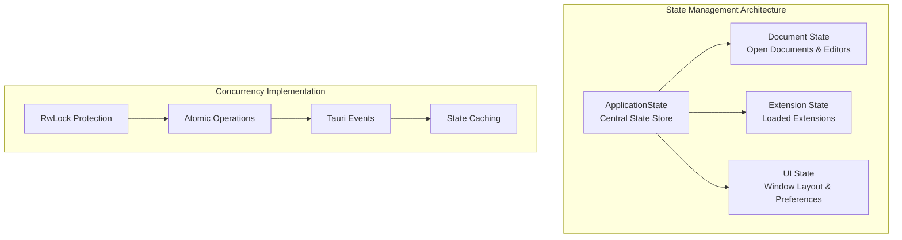
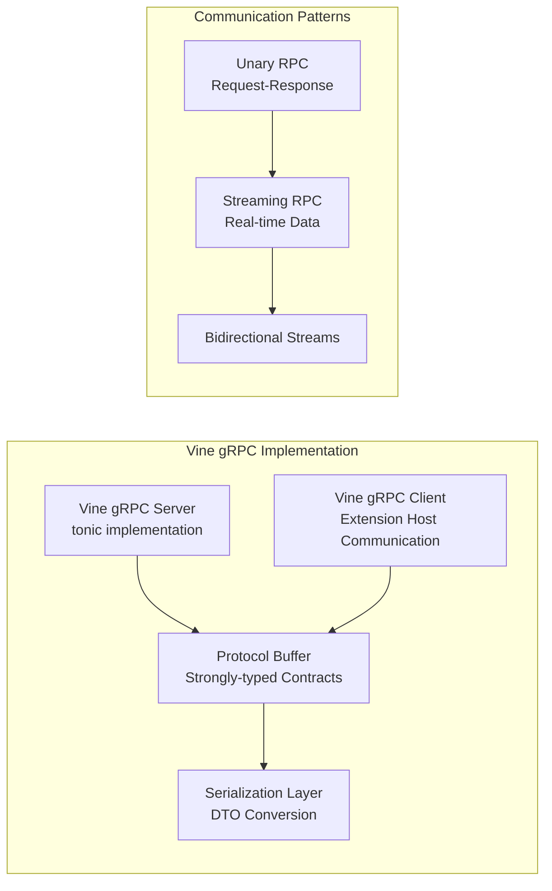
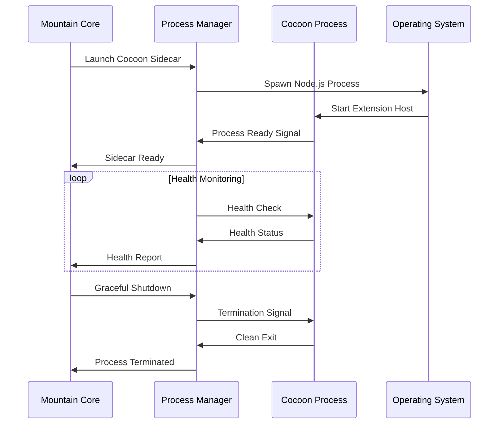
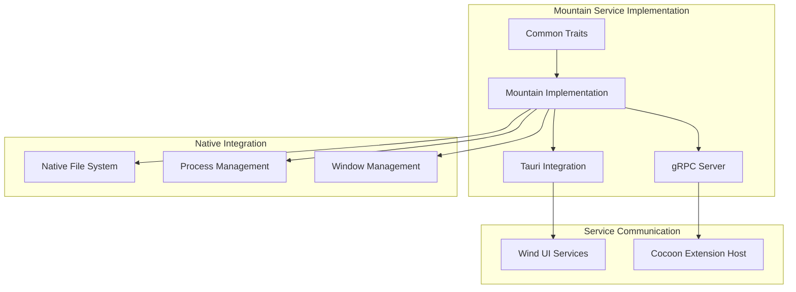
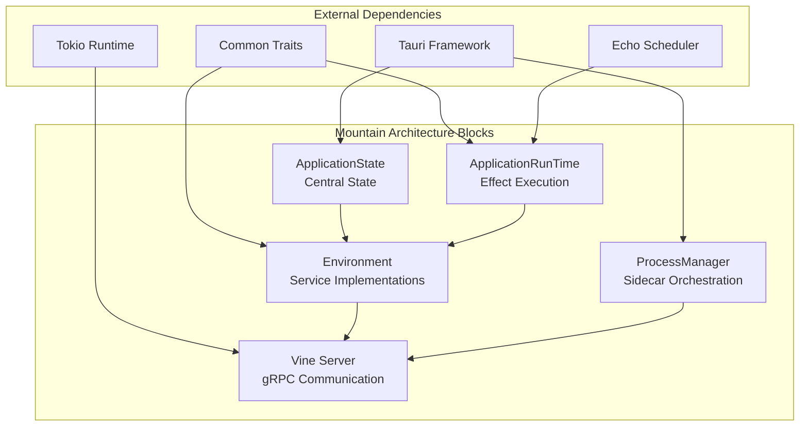

<table>
	<tr>
		<td align="left" valign="middle">
			<h3 align="left"> Mountain</h3>
		</td>
		<td align="left" valign="middle">
			<h3 align="left">
				⛰️
			</h3>
		</td>
		<td align="left" valign="middle">
			<h3 align="left"> + </h3>
		</td>
		<td align="left" valign="middle">
			<h3 align="left">
				<a href="https://Editor.Land" target="_blank">
					<picture>
						<source media="(prefers-color-scheme: dark)" srcset="https://editor.land/Dark/Image/GitHub/Land.svg">
						<source media="(prefers-color-scheme: light)" srcset="https://editor.land/Image/GitHub/Land.svg">
						
					</picture>
				</a>
			</h3>
		</td>
		<td align="left" valign="middle">
			<h3 align="left">
				<a href="https://Editor.Land" target="_blank">
					Land
				</a>
			</h3>
		</td>
		<td align="left" valign="middle">
			<h3 align="left">
				🏞️
			</h3>
		</td>
	</tr>
</table>

---

# **Mountain** ⛰️ Deep Dive & Architecture

**Mountain** provides the technical foundation for implementing VSCode services
as native Rust services within the Land project. **Mountain** serves as the
concrete implementation layer that brings VSCode service compatibility through
native Rust implementations, Tauri integration, and gRPC communication.

---

## Core Architecture Principles

| Principle                         | Description                                                                                                                                                    | Key Components Involved                          |
| :-------------------------------- | :------------------------------------------------------------------------------------------------------------------------------------------------------------- | :----------------------------------------------- |
| **Native Service Implementation** | Provide concrete implementations of all abstract service `trait`s defined in the `Common` crate, delivering native-speed performance for core operations.      | `Environment/*` providers                        |
| **Effect System Execution**       | Execute declarative `ActionEffect`s through a sophisticated `ApplicationRunTime` that bridges abstract effect descriptions with concrete native capabilities.  | `RunTime/*`, `Track/EffectCreation.rs`, `Common` |
| **Centralized State Management**  | Maintain a single, thread-safe `ApplicationState` struct managed by Tauri to ensure data consistency across the entire application lifecycle.                  | `ApplicationState/*`                             |
| **gRPC-Powered IPC**              | Utilize `tonic`-based gRPC for all communication with the `Cocoon` sidecar, ensuring a strongly-typed, high-performance API boundary.                          | `Vine/*`                                         |
| **Tauri Integration Excellence**  | Leverage Tauri's capabilities for cross-platform windowing, system integration, and secure communication while maintaining native performance characteristics. | `Binary.rs`, Tauri plugins                       |
| **Sidecar Orchestration**         | Reliably launch, manage, and communicate with the `Cocoon` Node.js extension host sidecar via robust process management and health monitoring.                 | `ProcessManagement/*`                            |

---

## Deep Dive into `Mountain`'s Concrete Components

### 1. The `ApplicationRunTime` Engine: Concrete Effect Execution

The `ApplicationRunTime` serves as the bridge between the declarative effect
system defined in `Common` and the concrete native implementations provided by
Mountain.

#### **Concrete Effect Execution Flow**



#### **Concrete Implementation**

```rust
// Mountain's ApplicationRunTime implementation
pub struct MountainRunTime {
    environment: Arc<MountainEnvironment>,
    scheduler: Arc<Echo::Scheduler::Scheduler>,
}

impl ApplicationRunTime for MountainRunTime {
    async fn run<C, E, T>(&self, effect: ActionEffect<C, E, T>) -> Result<T, E>
    where
        C: Send + Sync + 'static,
        E: std::error::Error + Send + Sync + 'static,
        T: Send + Sync + 'static,
    {
        // Resolve capability from environment
        let capability = self.environment.resolve_capability::<C>().await?;

        // Execute effect using the scheduler
        self.scheduler.submit(effect.execute(capability)).await
    }
}
```

### 2. Concrete State Management Architecture

The `ApplicationState` system provides concrete state management with advanced
concurrency guarantees:



#### **Concrete State Implementation**

```rust
#[derive(Debug)]
pub struct ApplicationState {
    // Thread-safe state management
    pub documents: Arc<RwLock<HashMap<String, Document>>>,
    pub extensions: Arc<RwLock<Vec<Extension>>>,
    pub ui_state: Arc<RwLock<UIState>>,
    pub preferences: Arc<RwLock<Preferences>>,
}

impl ApplicationState {
    pub async fn add_document(&self, document: Document) -> Result<(), CommonError> {
        let mut documents = self.documents.write().await;
        documents.insert(document.id.clone(), document);

        // Notify all listeners via Tauri events
        self.emit_event("document_added").await
    }

    pub async fn get_document(&self, id: &str) -> Option<Document> {
        let documents = self.documents.read().await;
        documents.get(id).cloned()
    }
}
```

### 3. Concrete gRPC Communication System

The `Vine` gRPC layer provides concrete communication with the `Cocoon`
extension host:



#### **Concrete gRPC Implementation**

```rust
// Vine gRPC service implementation
#[tonic::async_trait]
impl VineService for MountainVineService {
    async fn execute_command(
        &self,
        request: Request<CommandRequest>,
    ) -> Result<Response<CommandResponse>, Status> {
        let command_request = request.into_inner();

        // Convert gRPC request to Common effect
        let effect = convert_to_effect(command_request);

        // Execute via ApplicationRunTime
        let result = self.runtime.run(effect).await;

        // Convert result back to gRPC response
        let response = convert_to_response(result);
        Ok(Response::new(response))
    }
}
```

### 4. Concrete Process Management System

The process management system provides concrete sidecar orchestration:



#### **Concrete Process Management**

```rust
pub struct ProcessManager {
    cocoon_process: Option<Child>,
    health_check_interval: Duration,
}

impl ProcessManager {
    pub async fn launch_cocoon(&mut self) -> Result<(), CommonError> {
        let command = Command::new("node")
            .arg("./Target/Cocoon.js")
            .env("VINE_PORT", self.vine_port.to_string())
            .spawn()?;

        self.cocoon_process = Some(command);

        // Start health monitoring
        self.start_health_monitoring().await;

        Ok(())
    }

    async fn start_health_monitoring(&self) {
        tokio::spawn(async move {
            loop {
                tokio::time::sleep(self.health_check_interval).await;
                if !self.is_cocoon_healthy().await {
                    self.restart_cocoon().await;
                }
            }
        });
    }
}
```

---

## Concrete VSCode Service Lifting Implementation

### 1. File System Service Implementation

Mountain provides concrete implementations of VSCode file system services:

```rust
#[async_trait]
impl FileSystemService for MountainEnvironment {
    async fn ReadFile(&self, uri: &str) -> Result<Vec<u8>, CommonError> {
        let path = convert_uri_to_path(uri)?;

        // Use tokio for async file operations
        match tokio::fs::read(&path).await {
            Ok(content) => Ok(content),
            Err(e) => Err(CommonError::FileSystemError(e.to_string())),
        }
    }

    async fn WriteFile(&self, uri: &str, content: &[u8]) -> Result<(), CommonError> {
        let path = convert_uri_to_path(uri)?;

        // Create directory if it doesn't exist
        if let Some(parent) = path.parent() {
            tokio::fs::create_dir_all(parent).await?;
        }

        tokio::fs::write(&path, content).await
            .map_err(|e| CommonError::FileSystemError(e.to_string()))
    }

    async fn stat(&self, uri: &str) -> Result<FileStat, CommonError> {
        let path = convert_uri_to_path(uri)?;
        let metadata = tokio::fs::metadata(&path).await?;

        Ok(FileStat {
            is_file: metadata.is_file(),
            is_directory: metadata.is_dir(),
            size: metadata.len(),
            mtime: metadata.modified()?,
            atime: metadata.accessed()?,
        })
    }
}
```

### 2. Window Management Service Implementation

Concrete implementation of VSCode window management services:

```rust
#[async_trait]
impl WindowService for MountainEnvironment {
    async fn create_terminal(&self, options: TerminalOptions) -> Result<Terminal, CommonError> {
        // Use portable-pty for native terminal creation
        let pair = portable_pty::main::PtyPair::new(&options)?;

        let terminal = Terminal {
            id: generate_terminal_id(),
            pty_pair: Arc::new(pair),
            options,
        };

        // Add to application state
        self.app_state.add_terminal(terminal.clone()).await?;

        Ok(terminal)
    }

    async fn ShowInformationMessage(&self, message: &str) -> Result<(), CommonError> {
        // Use Tauri's notification system
        tauri::api::notification::Notification::new(&self.app_handle)
            .title("Information")
            .body(message)
            .show()?;

        Ok(())
    }
}
```

### 3. Workspace Service Implementation

Concrete workspace management for VSCode compatibility:

```rust
#[async_trait]
impl WorkspaceService for MountainEnvironment {
    async fn get_workspace_folders(&self) -> Result<Vec<WorkspaceFolder>, CommonError> {
        let state = self.app_state.read().await;
        Ok(state.workspace_folders.clone())
    }

    async fn UpdateWorkspaceFolders(&self, folders: Vec<WorkspaceFolder>) -> Result<(), CommonError> {
        let mut state = self.app_state.write().await;
        state.workspace_folders = folders;

        // Notify all listeners
        self.emit_workspace_changed_event().await?;

        Ok(())
    }

    async fn open_text_document(&self, uri: &str) -> Result<TextDocument, CommonError> {
        let content = self.ReadFile(uri).await?;
        let language_id = detect_language_id(uri);

        let document = TextDocument {
            uri: uri.to_string(),
            language_id,
            version: 1,
            content: String::from_utf8(content)?,
        };

        // Add to open documents
        self.app_state.add_document(document.clone()).await?;

        Ok(document)
    }
}
```

---

## Practical Performance Optimization

### 1. File System Caching Strategy

Mountain implements practical file system caching for performance:

```rust
pub struct FileSystemCache {
    cache: Arc<RwLock<LruCache<String, Vec<u8>>>>,
    max_size: usize,
}

impl FileSystemCache {
    pub async fn get(&self, path: &str) -> Option<Vec<u8>> {
        let cache = self.cache.read().await;
        cache.get(path).cloned()
    }

    pub async fn put(&self, path: String, content: Vec<u8>) {
        let mut cache = self.cache.write().await;

        // Evict oldest entries if cache is full
        while cache.len() >= self.max_size {
            cache.pop_lru();
        }

        cache.put(path, content);
    }
}
```

### 2. Terminal Performance Optimization

Practical terminal performance optimizations:

```rust
pub struct TerminalManager {
    terminals: Arc<RwLock<HashMap<String, Terminal>>>,
    output_buffers: Arc<RwLock<HashMap<String, VecDeque<u8>>>>,
}

impl TerminalManager {
    pub async fn write_to_terminal(&self, terminal_id: &str, data: &[u8]) -> Result<(), CommonError> {
        // Batch small writes for performance
        if data.len() < 1024 {
            self.buffer_small_write(terminal_id, data).await
        } else {
            self.immediate_write(terminal_id, data).await
        }
    }

    async fn buffer_small_write(&self, terminal_id: &str, data: &[u8]) -> Result<(), CommonError> {
        let mut buffers = self.output_buffers.write().await;
        let buffer = buffers.entry(terminal_id.to_string()).or_insert_with(VecDeque::new);

        // Aggregate small writes
        buffer.extend(data);

        // Flush if buffer reaches threshold
        if buffer.len() >= 512 {
            self.flush_buffer(terminal_id, buffer).await?;
        }

        Ok(())
    }
}
```

### 3. gRPC Connection Pooling

Practical gRPC connection management:

```rust
pub struct ConnectionPool {
    connections: Arc<RwLock<Vec<Channel>>>,
    max_connections: usize,
}

impl ConnectionPool {
    pub async fn get_connection(&self) -> Result<Channel, CommonError> {
        let mut connections = self.connections.write().await;

        // Reuse existing connection if available
        if let Some(channel) = connections.pop() {
            if channel.ready().await.is_ok() {
                return Ok(channel);
            }
        }

        // Create new connection
        if connections.len() < self.max_connections {
            let channel = Channel::from_static("http://[::1]:50051")
                .connect()
                .await?;

            Ok(channel)
        } else {
            Err(CommonError::ResourceExhausted("Connection pool exhausted".to_string()))
        }
    }

    pub async fn return_connection(&self, channel: Channel) {
        let mut connections = self.connections.write().await;
        connections.push(channel);
    }
}
```

---

## Concrete Security Implementation

### 1. File Path Sanitization

Practical security measures for file operations:

```rust
pub fn sanitize_file_path(path: &str) -> Result<PathBuf, CommonError> {
    let path = PathBuf::from(path);

    // Prevent directory traversal attacks
    if path.components().any(|c| matches!(c, Component::ParentDir)) {
        return Err(CommonError::SecurityError("Path traversal attempt detected".to_string()));
    }

    // Normalize path
    let normalized = path.canonicalize()?;

    // Ensure path is within allowed directories
    if !normalized.starts_with(allowed_base_directory()) {
        return Err(CommonError::SecurityError("Path outside allowed directory".to_string()));
    }

    Ok(normalized)
}
```

### 2. Extension Sandboxing

Practical extension security measures:

```rust
pub struct ExtensionSecurity {
    allowed_apis: HashSet<String>,
    resource_limits: ResourceLimits,
}

impl ExtensionSecurity {
    pub fn validate_api_call(&self, api_name: &str) -> Result<(), CommonError> {
        if self.allowed_apis.contains(api_name) {
            Ok(())
        } else {
            Err(CommonError::SecurityError(format!("API {} not allowed", api_name)))
        }
    }

    pub fn check_resource_limits(&self, extension_id: &str) -> Result<(), CommonError> {
        let usage = self.get_resource_usage(extension_id)?;

        if usage.memory > self.resource_limits.max_memory {
            return Err(CommonError::ResourceExhausted("Memory limit exceeded".to_string()));
        }

        if usage.cpu_time > self.resource_limits.max_cpu_time {
            return Err(CommonError::ResourceExhausted("CPU time limit exceeded".to_string()));
        }

        Ok(())
    }
}
```

---

## Practical Monitoring and Diagnostics

### 1. Performance Metrics Collection

Concrete performance monitoring implementation:

```rust
pub struct PerformanceMetrics {
    effect_executions: AtomicU64,
    average_latency: AtomicU64,
    error_count: AtomicU64,
}

impl PerformanceMetrics {
    pub fn record_effect_execution(&self, duration: Duration) {
        self.effect_executions.fetch_add(1, Ordering::Relaxed);

        // Update rolling average
        let current_avg = self.average_latency.load(Ordering::Relaxed);
        let new_avg = (current_avg + duration.as_micros() as u64) / 2;
        self.average_latency.store(new_avg, Ordering::Relaxed);
    }

    pub fn get_metrics(&self) -> MetricsSnapshot {
        MetricsSnapshot {
            executions_per_second: self.calculate_eps(),
            average_latency_micros: self.average_latency.load(Ordering::Relaxed),
            error_rate: self.error_count.load(Ordering::Relaxed) as f64 /
                       self.effect_executions.load(Ordering::Relaxed) as f64,
        }
    }
}
```

### 2. Health Check System

Practical health monitoring:

```rust
pub struct HealthMonitor {
    last_healthy: AtomicU64,
    check_interval: Duration,
}

impl HealthMonitor {
    pub async fn start_monitoring(&self) {
        loop {
            tokio::time::sleep(self.check_interval).await;

            if !self.perform_health_check().await {
                log::error!("Health check failed");
                self.trigger_recovery().await;
            } else {
                self.last_healthy.store(
                    std::time::SystemTime::now()
                        .duration_since(std::time::UNIX_EPOCH)
                        .unwrap()
                        .as_secs(),
                    Ordering::Relaxed
                );
            }
        }
    }

    async fn perform_health_check(&self) -> bool {
        // Check critical system components
        self.check_file_system().await &&
        self.check_memory().await &&
        self.check_extension_host().await
    }
}
```

---

## Concrete Development Guidelines

### 1. Adding New VSCode Services

When implementing new VSCode services in Mountain:

```rust
// 1. Define the service trait in Common
#[async_trait]
pub trait NewVSCodeService: Send + Sync {
    async fn operation1(&self, param: ParamType) -> Result<ReturnType, CommonError>;
    async fn operation2(&self) -> Result<OtherType, CommonError>;
}

// 2. Implement effect constructors in Common
pub fn operation1_effect(param: ParamType) -> ActionEffect<Arc<dyn NewVSCodeService>, CommonError, ReturnType> {
    ActionEffect::new(move |service: Arc<dyn NewVSCodeService>| {
        Box::pin(async move { service.operation1(param).await })
    })
}

// 3. Implement concrete service in Mountain
#[async_trait]
impl NewVSCodeService for MountainEnvironment {
    async fn operation1(&self, param: ParamType) -> Result<ReturnType, CommonError> {
        // Concrete implementation using native APIs
        native_operation(param).await
    }
}
```

### 2. Performance Testing Patterns

Practical performance testing strategies:

```rust
#[cfg(test)]
mod performance_tests {
    use super::*;

    #[tokio::test]
    async fn test_file_read_performance() {
        let environment = MountainEnvironment::new();
        let test_data = generate_test_data(1024 * 1024); // 1MB test data

        // Measure execution time
        let start = std::time::Instant::now();
        let result = environment.ReadFile("test://large-file").await;
        let duration = start.elapsed();

        assert!(result.is_ok());
        assert!(duration < std::time::Duration::from_millis(100));
    }
}
```

### Concrete VSCode Service Lifting Architecture



#### Service Implementation Table

| VSCode Service          | Common Trait           | Mountain Implementation | Communication Protocol |
| :---------------------- | :--------------------- | :---------------------- | :--------------------- |
| `IFileService`          | `FileSystemService`    | `MountainFileSystem`    | gRPC + Tauri           |
| `IWorkspaceService`     | `WorkspaceService`     | `MountainWorkspace`     | gRPC + Tauri           |
| `IConfigurationService` | `ConfigurationService` | `MountainConfiguration` | gRPC + Tauri           |
| `ICommandService`       | `CommandService`       | `MountainCommand`       | gRPC + Tauri           |
| `IDocumentService`      | `DocumentProvider`     | `MountainDocument`      | gRPC + Tauri           |

---

## IPC Handler Architecture

### Atomization Pattern

Every IPC command exposed to the Wind/Sky frontend lives in its own dedicated
`.rs` file. The top-level `mod.rs` (`IPC/WindServiceHandlers/mod.rs`, ~2 500
lines) imports every atom and dispatches via a single `match` arm per command
string. Nothing is implemented inline in `mod.rs` except trivially short
responses that are not reused anywhere.

**File and struct naming** follow PascalCase throughout:

```
NativeHost/Quit.rs       → pub struct NativeQuit; impl Fn(…)
NativeHost/Relaunch.rs   → pub struct NativeRelaunch; impl Fn(…)
Encryption/Key.rs        → pub fn Fn() -> Result<[u8;32], String>
Terminal/LocalPTYCreateProcess.rs → pub struct LocalPTYCreateProcess; …
```

**Domain subdirectories** currently in `WindServiceHandlers/`:

| Directory        | Responsibility                                                   |
| :--------------- | :--------------------------------------------------------------- |
| `Cocoon/`        | `cocoon:request`, `cocoon:notify`, `cocoon:extensionHostMessage` |
| `Commands/`      | `commands:*` execution and registration                          |
| `Configuration/` | `config:*` read/write/watch                                      |
| `Encryption/`    | `encryption:encrypt` / `encryption:decrypt`                      |
| `Extension/`     | Per-extension info queries                                       |
| `ExtensionHost/` | `extensionHostStarter:*`, `extensionhostdebugservice:*`          |
| `Extensions/`    | `extensions:*` scan, install, get-installed                      |
| `FileSystem/`    | `file:*` read, write, watch, stat, fd table                      |
| `Git/`           | `git:*` operations                                               |
| `Model/`         | `sky:model:*` content sync                                       |
| `NativeDialog/`  | `nativeDialog:*` file/folder pickers                             |
| `NativeHost/`    | `nativeHost:*` OS-level helpers (clipboard, paths, dialogs)      |
| `Navigation/`    | `editor:*` navigation requests                                   |
| `Output/`        | Output channel forwarding                                        |
| `Search/`        | `search:*` file-content search                                   |
| `Sky/`           | `sky:replay-events` and related Sky bridge handlers              |
| `Storage/`       | `storage:get` / `storage:set` key-value persistence              |
| `Terminal/`      | `localPty:*` - PTY create, resize, attach, revive                |
| `TreeView/`      | `tree:getChildren`, `tree:selectionChanged`, reveal              |
| `UI/`            | `window:*`, decorations, progress                                |
| `Update/`        | `update:*` lifecycle (no-op stubs; no update server)             |
| `Utilities/`     | Shared helpers used across handler files                         |

---

## ISandboxConfiguration

`ProcessManagement/InitializationData.rs` contains two builders that fire at
application startup:

- **`ConstructSandboxConfiguration`** - produces the `ISandboxConfiguration`
  JSON payload delivered to the Sky (VS Code workbench) frontend.
- **`ConstructExtensionHostInitializationData`** - produces the
  `IExtensionHostInitData` JSON payload delivered to Cocoon.

### Critical ISandboxConfiguration fields

Several fields that VS Code's `NativeWorkbenchEnvironmentService` accesses
without null-guards must always be present. Omitting any of them causes a boot
crash in the bundled workbench:

| Field                  | Consumer                                                              | Notes                                                  |
| :--------------------- | :-------------------------------------------------------------------- | :----------------------------------------------------- |
| `logsPath`             | `NativeWorkbenchEnvironmentService.logsHome`                          | URI string                                             |
| `dataFolderName`       | Extension path construction - **primary crash source when undefined** | `URI.joinPath(userHome, dataFolderName, "extensions")` |
| `sharedDataFolderName` | `appSharedDataHome`                                                   |                                                        |
| `version`              | Extension compatibility checks                                        |                                                        |
| `perfMarks`            | Required non-optional array                                           | Must be `[]`                                           |
| `colorScheme`          | Window theming                                                        | Must be `{ dark: bool, highContrast: bool }`           |
| `loggers`              | Required non-optional array                                           | Must be `[]`                                           |
| `mainPid`              | Shared-process communication                                          | `std::process::id()` as number                         |
| `os`                   | OS-specific code paths                                                | `{ release, hostname, arch }`                          |
| `profiles`             | `reviveProfile()` called on every URI field                           | See below                                              |

### profiles section

`profiles` must contain `home`, `all` (array), and a default `profile` object.
The default profile itself must carry **all 13 URI fields** - including
`languageModelsResource` - as `{ scheme, authority, path, query, fragment }`
objects, because VS Code calls `.with(...)` on every one without a null check.

To avoid hitting `json!` macro recursion limits, all sub-objects
(`ProfilesSection`, `ProductConfig`, `NlsSection`, `OsSection`) are pre-built as
`serde_json::Value` bindings before the main `json!({...})` call.

---

## Encryption Provider

Three files in `IPC/WindServiceHandlers/Encryption/` back the
`encryption:encrypt` and `encryption:decrypt` IPC commands that Cocoon uses for
`context.secrets`:

### `Key.rs`

Derives a machine-stable 256-bit key once per process:

```
key = SHA-256("Land-Encryption-v1" ++ machine_id)
```

The machine ID is read from the OS-native source:

- **macOS**: `ioreg -rd1 -c IOPlatformExpertDevice` → `IOPlatformUUID`
- **Linux**: `/etc/machine-id` or `/var/lib/dbus/machine-id`
- **Windows**: Registry `HKLM\SOFTWARE\Microsoft\Cryptography\MachineGuid`

If the machine ID cannot be obtained the function returns `Err` so callers
surface a meaningful error rather than falling back to a predictable constant.
The derived key is stored in a `OnceLock<Option<[u8;32]>>` - computed once,
reused for the lifetime of the process.

### `Encrypt.rs` / `Decrypt.rs`

AES-256-GCM symmetric encryption:

- `encryption:encrypt` → returns `{ ciphertext, nonce }` (base-64 encoded)
- `encryption:decrypt` → accepts `{ ciphertext, nonce }`, returns plaintext

Used by Cocoon's `context.secrets` API (`secrets.get` / `secrets.store` /
`secrets.delete` IPC calls route through Mountain's storage backed by these two
handlers).

---

## Extension Scanning and Cache

### Boot-time cache (`LoadFromCache.rs`)

`Maintain/Build/Manifest/PreBake.ts` runs as a `beforeBundleCommand` hook (fires
in all build paths: direct `pnpm tauri build`, `Build.sh`, CI). It walks every
extension root and writes `extensions.manifest.json` into the bundle resources.

At runtime `ApplicationState/Internal/ExtensionScanner/LoadFromCache.rs` reads
that pre-baked manifest. Cold load time: **<50 ms** vs ~1 200 ms for a live
directory scan.

### Fallback (`ScanAndPopulateExtensions.rs`)

If the cache file is absent (first run from source, dev builds without
`beforeBundleCommand`), `ScanAndPopulateExtensions.rs` falls back to a parallel
`join_all` scan over all extension roots, then writes the result for subsequent
runs.

### Per-request cache (`ExtensionsGetInstalled.rs`)

`ExtensionsGetInstalled` is called on every `extensions:getInstalled` IPC
request. Results are cached in a `OnceLock` keyed by `ExtensionTypeFilter`
variant (Builtin / User / All) so the first call per filter pays the scan cost
and subsequent calls are free.

---

## Cocoon Management

`ProcessManagement/CocoonManagement.rs` spawns and monitors the Cocoon Node.js
sidecar:

| Detail                       | Value / Notes                                                    |
| :--------------------------- | :--------------------------------------------------------------- |
| Cocoon gRPC port             | 50052 (Mountain's Vine gRPC server is on **50051**)              |
| Mountain gRPC connect budget | `GRPC_CONNECT_BUDGET_MS = 30_000` (30 seconds)                   |
| IO forwarder runtime         | `tauri::async_runtime::spawn` - **not** `tokio::spawn`           |
| Bootstrap script             | `scripts/cocoon/bootstrap-fork.js` (bundled sidecar)             |
| WebSocket config             | Port picked at spawn time via `portpicker`, stored in `OnceLock` |

The 30-second budget exists to give Cocoon enough time to complete its own
bootstrap stages (especially the `RPCServer` stage that must bind port 50052
before Mountain attempts a gRPC handshake).

### Component Block Map


