<table>
	<tr>
		<td align="left" valign="middle">
			<h3 align="left">Mountain&#x2001;⛰️</h3>
		</td>
		<td align="left" valign="middle">
			<h3 align="left">&#x2001;+&#x2001;</h3>
		</td>
		<td align="left" valign="middle">
			<h3 align="left">
				<a href="https://Editor.Land" target="_blank">
					<picture>
						<source media="(prefers-color-scheme: dark)" srcset="https://PlayForm.Cloud/Dark/Image/GitHub/Land.svg">
						<source media="(prefers-color-scheme: light)" srcset="https://PlayForm.Cloud/Image/GitHub/Land.svg">
						
					</picture>
				</a>
			</h3>
		</td>
		<td align="left" valign="middle">
			<h3 align="left">
				<a href="https://Editor.Land" target="_blank">Land&#x2001;🏞️</a>
			</h3>
		</td>
		<td align="left" valign="middle">
			<h3 align="left">&#x2001;+&#x2001;</h3>
		</td>
		<td align="left" valign="middle" width="190">
			<h3 align="left">
				<a href="https://Tauri.App" target="_blank">
					
				</a>
			</h3>
		</td>
	</tr>
</table>

---

# **Mountain**&#x2001;⛰️

The Bedrock of `Land`: Native Backend & Service Host.

> **The RAM tax is not optional.** `VS Code` with a medium project: 500 MB to
> 1.5 GB of RAM. Three open windows means three `Chromium` renderer processes,
> each carrying a full heap. Every OS interaction crosses a serialized JSON IPC
> pipe.

_"Where `Electron` takes 200 ms to open a dialog, `Mountain` takes 2."_

[](https://github.com/CodeEditorLand/Mountain/tree/Current/LICENSE)
[](https://www.rust-lang.org/)&#x2001;[](https://www.rust-lang.org/)
[](https://tauri.app/)&#x2001;[](https://tauri.app/)
[](https://github.com/hyperium/tonic)

**[Rust API Documentation](https://Rust.Documentation.Editor.Land/Mountain/)**&#x2001;📖

**Mountain**&#x2001;⛰️ is the native `Rust` backend and `Tauri` application
shell for the `Land` Code Editor. It serves as the foundational bedrock for the
entire system, managing the application lifecycle, orchestrating native OS
operations, and providing high-performance services to the `Wind` frontend and
the `Cocoon` extension host.

**Mountain**&#x2001;⛰️ is engineered to:

1. **Be the Native Core:** Act as the primary `Rust` application, leveraging
   `Tauri` to create a lightweight, cross-platform windowing and `WebView` host.
2. **Provide High-Performance Services:** Implement the abstract service
   `trait`s defined in the `Common` crate, offering native-speed implementations
   for filesystem I/O, process management, secure storage, and more.
3. **Orchestrate Sidecars:** Reliably launch, manage, and communicate with the
   `Cocoon` (`Node.js`) extension host sidecar via a robust `gRPC` interface.
4. **Power the User Interface:** Serve as the backend for the `Wind` layer,
   responding to requests via `Tauri` commands and pushing state updates via
   `Tauri` events.

---

## Key Features&#x2001;🔐

- **Declarative Effect System:** Built on a `Rust` `ActionEffect` system defined
  in the `Common` crate. Business logic is described as declarative, composable
  effects, executed by a central `ApplicationRunTime`.
- **`gRPC`-Powered IPC:** Hosts a `tonic`-based `gRPC` server (`Vine`) to
  provide a strongly-typed, high-performance communication channel for the
  `Cocoon` extension host.
- **Centralized State Management:** Utilizes a thread-safe, `Tauri`-managed
  `ApplicationState` as the single source of truth for the entire application's
  state, from open documents to provider registrations.
- **Native PTY Management:** Implements a full-featured integrated terminal
  service by spawning and managing native pseudo-terminals (`PTY`) using the
  `portable-pty` crate.
- **Secure Storage Integration:** Leverages the native OS keychain via the
  `keyring` crate to securely store sensitive data like authentication tokens.
- **Robust Command Dispatching:** A central `Track` dispatcher intelligently
  routes all incoming requests from `Wind` and `Cocoon` to the appropriate
  native `Environment` provider or `ActionEffect`.

---

## Core Architecture Principles&#x2001;🏗️

| Principle                       | Description                                                                                                                                   | Key Components                                   |
| :------------------------------ | :-------------------------------------------------------------------------------------------------------------------------------------------- | :----------------------------------------------- |
| **Implementation of Contracts** | Implement the abstract service `trait`s from `Common`, providing concrete logic for the application's architecture.                           | `Environment/*` providers                        |
| **Separation of Concerns**      | Isolate service logic into distinct `Environment` provider modules, each responsible for a specific domain (e.g., `FileSystem`, `Documents`). | `Environment/*`, `Command/*`                     |
| **Declarative Logic**           | Express complex operations as `ActionEffect`s, executed by `ApplicationRunTime` - composable, testable, and robust.                           | `RunTime/*`, `Track/EffectCreation.rs`, `Common` |
| **Centralized State**           | Maintain a single, thread-safe `ApplicationState` struct managed by `Tauri` for data consistency across the entire application.               | `ApplicationState/*`                             |
| **Secure & Performant IPC**     | Use `gRPC` for all communication with the `Cocoon` sidecar, ensuring a well-defined and high-performance API boundary.                        | `Vine/*`                                         |
| **UI-Backend Decoupling**       | Interact with `Wind` exclusively through asynchronous `Tauri` commands and events, keeping the backend UI-agnostic.                           | `Binary/*` (invoke handler), `Command/*`         |

---

## Deep Dive & Component Breakdown&#x2001;🔬

To understand how `Mountain`'s internal components are structured and how they
implement the application's core logic, see
[`Documentation/GitHub/DeepDive.md`](https://github.com/CodeEditorLand/Mountain/tree/Current/Documentation/GitHub/DeepDive.md).
This document explains the roles of `ApplicationRunTime`, `ApplicationState`,
`Handler`, `Environment`, and the `Vine` `gRPC` layer.

---

## `Mountain`&#x2001;⛰️ in the `Land`&#x2001;🏞️ Ecosystem&#x2001;⛰️&#x2001;+&#x2001;🏞️

This diagram illustrates `Mountain`'s central role as the native orchestrator
for the entire `Land` application.

```mermaid
graph LR
    classDef mountain fill:#f0d0ff,stroke:#9b59b6,stroke-width:2px,color:#2c0050;
    classDef cocoon   fill:#d0d8ff,stroke:#4a6fa5,stroke-width:2px,color:#001050;
    classDef wind     fill:#cce8ff,stroke:#2980b9,stroke-width:2px,color:#00304a;
    classDef common   fill:#d4f5d4,stroke:#27ae60,stroke-width:1px,stroke-dasharray:5 5,color:#0a3a0a;
    classDef ipc      fill:#fff3c0,stroke:#f39c12,stroke-width:1px,stroke-dasharray:5 5,color:#5a3e00;

    subgraph "Mountain - Native Rust/Tauri Backend&#x2001;⛰️"
        TauriRuntime["Tauri App & Window&#x2001;🚀"]:::mountain
        ApplicationRunTime["ApplicationRunTime Engine&#x2001;⚡"]:::mountain
        ApplicationState["ApplicationState - Shared State&#x2001;🗄️"]:::mountain
        TrackDispatcher["Track Dispatcher&#x2001;🔀"]:::mountain
        VinegRPC["Vine - gRPC Server&#x2001;🌿"]:::ipc
        EnvironmentProviders["Environment Providers&#x2001;⚙️"]:::mountain
        CommonCrate["Common Crate - Traits & DTOs&#x2001;📐"]:::common
    end

    subgraph "Clients&#x2001;🖥️"
        WindUI["Wind / Sky - UI WebView&#x2001;🍃"]:::wind
        CocoonSideCar["Cocoon - Extension Host (Node.js)&#x2001;🦋"]:::cocoon
    end

    TauriRuntime -- hosts --> WindUI
    WindUI -- Tauri Command --> TrackDispatcher
    TrackDispatcher -- Tauri Events --> WindUI
    VinegRPC <-- gRPC --> CocoonSideCar
    VinegRPC -- forwards --> TrackDispatcher
    EnvironmentProviders -. implements traits .-> CommonCrate
```



---

## Project Structure&#x2001;🗺️

The `Mountain` repository is organized to clearly separate concerns, following
the architectural patterns defined in `Common`.

```
Mountain/
├── Source/
│   ├── Library.rs                     # Library entry point, Tauri setup.
│   ├── LandFixTier.rs                 # Compile-time tier variable boot banner.
│   ├── Air/                           # gRPC client for the Air daemon (updates, auth, indexing, search, metrics).
│   ├── ApplicationState/              # Thread-safe state machine with DTOs, persistence, recovery, and feature state.
│   ├── Binary/                        # Application lifecycle, Tauri command registration, initialization, shutdown.
│   ├── Cache/                         # Asset memory-mapped cache and process-wide path canonicalization cache.
│   ├── Command/                       # Tauri command handlers grouped by domain (Keybinding, LanguageFeature, TreeView, etc.).
│   ├── Environment/                   # Concrete implementations of Common provider traits (filesystem, documents, terminal, etc.).
│   ├── Error/                         # Local error taxonomy (currently superseded by Common::CommonError).
│   ├── ExtensionManagement/           # Extension discovery, manifest parsing, and VSIX installation.
│   ├── FileSystem/                    # Native file-explorer tree-view provider for the workspace sidebar.
│   ├── IPC/                           # Inter-process communication: Tauri IPC server, Wind service handlers, encryption, permissions, status reporting.
│   ├── ProcessManagement/             # Sidecar process lifecycle, Node.js binary resolution (nvm, fnm, asdf, volta, homebrew, shipped).
│   ├── RPC/                           # gRPC service implementations (CocoonService) and scaffolding for multi-extension-host roadmap.
│   ├── RunTime/                       # Effect execution engine (ApplicationRunTime, Execute, graceful Shutdown).
│   ├── Telemetry/                     # Feature-gated observability: tracing, metrics, feature flags, and runtime gates.
│   ├── Track/                         # Central request dispatcher routing frontend and sidecar commands into ActionEffects.
│   ├── Update/                        # Application self-updating via Tauri bundled updater and optional Air gRPC delegation.
│   ├── Vine/                          # gRPC IPC layer: server, client, multiplexer, and generated protobuf bindings.
│   └── Workspace/                     # Workspace file (.code-workspace) parsing and multi-root folder resolution.
├── Proto/
│   └── Vine.proto                     # The gRPC contract definition file.
├── Documentation/
│   ├── GitHub/                        # DeepDive.md, NamingConventions.md
│   └── Rust/                          # Generated rustdoc output.
├── build.rs                           # Build script: proto compilation and tier propagation.
└── Cargo.toml
```

---

## Development Setup&#x2001;🛠️

`Mountain` is a `Rust` crate and a core component of the **Land** repository. It
is built as part of the monorepo. For detailed build instructions, see
[`Documentation/GitHub/Building.md`](https://github.com/CodeEditorLand/Land/tree/Current/Documentation/GitHub/Building.md).

**Key Dependencies:**

| Crate / Package        | Purpose                                           |
| :--------------------- | :------------------------------------------------ |
| `Common`               | Local path dependency - abstract traits & DTOs    |
| `Echo`                 | Local path dependency - work-stealing scheduler   |
| `keyring`              | Secure OS keychain access                         |
| `log` & `env_logger`   | Structured logging                                |
| `portable-pty`         | Cross-platform native PTY for integrated terminal |
| `serde` & `serde_json` | Serialization / deserialization                   |
| `tauri`                | `^2.x` - windowing, WebView, command dispatch     |
| `tokio`                | Async runtime                                     |
| `tonic`                | `gRPC` server implementation                      |

---

## See Also

- [Mountain Documentation](https://editor.land/Doc/mountain)
- [Architecture Overview](https://editor.land/Doc/architecture)
- [Why `Rust`](https://editor.land/Doc/why-rust)
- [Why `Tauri`](https://editor.land/Doc/why-tauri)
- [`Cocoon`](https://github.com/CodeEditorLand/Cocoon)
- [`Vine`](https://github.com/CodeEditorLand/Vine)
- [`Echo`](https://github.com/CodeEditorLand/Echo)
- [`Air`](https://github.com/CodeEditorLand/Air)

---

## License&#x2001;⚖️

This project is released into the public domain under the **Creative Commons CC0
Universal** license. You are free to use, modify, distribute, and build upon
this work for any purpose, without any restrictions. For the full legal text,
see the [`LICENSE`](https://github.com/CodeEditorLand/Mountain/tree/Current/)
file.

---

## Changelog&#x2001;📜

See [`CHANGELOG.md`](https://github.com/CodeEditorLand/Mountain/tree/Current/)
for a history of changes specific to **Mountain**&#x2001;⛰️.

---

## Funding \\& Acknowledgements&#x2001;🙏🏻

**Mountain**&#x2001;⛰️ is a core element of the **Land**&#x2001;🏞️ ecosystem.
This project is funded through
[NGI0 Commons Fund](https://NLnet.NL/commonsfund), a fund established by
[NLnet](https://NLnet.NL) with financial support from the European Commission's
[Next Generation Internet](https://ngi.eu) program. Learn more at the
[NLnet project page](https://NLnet.NL/project/Land).

The project is operated by PlayForm, based in Sofia, Bulgaria.

PlayForm acts as the open-source steward for Code Editor Land under the NGI0
Commons Fund grant.

<table>
	<thead>
		<tr>
			<th align="left"><strong>Land</strong></th>
			<th align="left"><strong>PlayForm</strong></th>
			<th align="left"><strong>NLnet</strong></th>
			<th align="left"><strong>NGI0 Commons Fund</strong></th>
		</tr>
	</thead>
	<tbody>
		<tr>
			<td align="left" valign="middle">
				<a href="https://Editor.Land">
					
				</a>
			</td>
			<td align="left" valign="middle">
				<a href="https://PlayForm.Cloud">
					
				</a>
			</td>
			<td align="left" valign="middle">
				<a href="https://NLnet.NL">
					
				</a>
			</td>
			<td align="left" valign="middle">
				<a href="https://NLnet.NL/commonsfund">
					
				</a>
			</td>
		</tr>
	</tbody>
</table>

---

**Project Maintainers**: Source Open
([Source/Open@Editor.Land](mailto:Source/Open@Editor.Land)) |
[GitHub Repository](https://github.com/CodeEditorLand/Mountain) |
[Report an Issue](https://github.com/CodeEditorLand/Mountain/issues) |
[Security Policy](https://github.com/CodeEditorLand/Mountain/security/policy)
