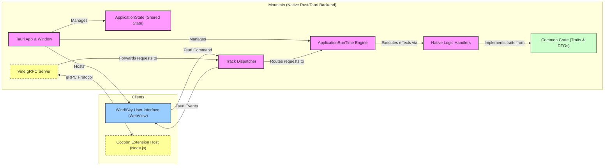

<table><tr>
<td colspan="1"> <h3 align="center"> <picture>
<source media="(prefers-color-scheme: dark)" srcset="https://PlayForm.Cloud/Dark/Image/GitHub/Land.svg">
<source media="(prefers-color-scheme: light)" srcset="https://PlayForm.Cloud/Image/GitHub/Land.svg">

</picture> </h3> </td> <td colspan="3" valign="top"> <h3 align="center"> Mountain ⛰️
</h3> </td>
</tr></table>

---

# **Mountain** ⛰️ The Bedrock of Land: Native Backend & Service Host

[](https://github.com/CodeEditorLand/Mountain/tree/Current/LICENSE)
[](https://www.rust-lang.org/)
[](https://tauri.app/)
[](https://github.com/hyperium/tonic)

Welcome to **Mountain**! This element is the native Rust backend and Tauri
application shell for the Land Code Editor. It serves as the foundational
bedrock for the entire system, managing the application lifecycle, orchestrating
native OS operations, and providing high-performance services to the `Wind`
frontend and the `Cocoon` extension host.

**Mountain** is engineered to:

1.  **Be the Native Core:** Act as the primary Rust application, leveraging
    Tauri to create a lightweight, cross-platform windowing and webview host.
2.  **Provide High-Performance Services:** Implement the abstract service traits
    defined in the `Common` crate, offering native-speed implementations for
    filesystem I/O, process management, secure storage, and more.
3.  **Orchestrate Sidecars:** Reliably launch, manage, and communicate with the
    `Cocoon` (Node.js) extension host sidecar via a robust gRPC interface.
4.  **Power the User Interface:** Serve as the backend for the `Wind` User Interface layer, responding
    to requests via Tauri commands and pushing state updates via Tauri events.

---

## Key Features 🔐

- **Declarative Effect System:** Built on a custom Rust `ActionEffect` system
  defined in the `Common` crate. All business logic is described as declarative,
  composable effects, which are executed by a central `ApplicationRunTime`.
- **gRPC-Powered IPC:** Hosts a `tonic`-based gRPC server (`Vine`) to provide a
  strongly-typed, high-performance communication channel for the `Cocoon`
  extension host.
- **Centralized State Management:** Utilizes a thread-safe, Tauri-managed
  `ApplicationState` to act as the single source of truth for the entire
  application's state, from open documents to provider registrations.
- **Native PTY Management:** Implements a full-featured integrated terminal
  service by spawning and managing native pseudo-terminals (`PTY`) using the
  `portable-pty` crate.
- **Secure Storage Integration:** Leverages the native OS keychain via the
  `keyring` crate to securely store sensitive data like authentication tokens.
- **Robust Command Dispatching:** A central `Track` dispatcher intelligently
  routes all incoming requests from the User Interface (`Wind`) and extensions (`Cocoon`) to
  the appropriate native Handler or effects.

---

## Core Architecture Principles 🏗️

| Principle                       | Description                                                                                                                                        | Key Components Involved                             |
| :------------------------------ | :------------------------------------------------------------------------------------------------------------------------------------------------- | :-------------------------------------------------- |
| **Implementation of Contracts** | Faithfully implement the abstract service `trait`s defined in the `Common` crate, providing the concrete logic for the application's architecture. | `Environment/*` providers                           |
| **Separation of Concerns**      | Isolate business logic in `Handler` modules, keeping the `Environment` provider implementations clean and focused on delegation.                  | `Environment/*`, `Handler/*`                       |
| **Declarative Logic**           | Express all operations as `ActionEffect`s, which are executed by the `ApplicationRunTime`. This makes logic composable, testable, and robust.              | `RunTime/*`, `track/*`, `Common::effect`            |
| **Centralized State**           | Maintain a single, thread-safe `ApplicationState` struct managed by Tauri to ensure data consistency across the entire application.                | `app_state/*`                                       |
| **Secure & Performant IPC**     | Utilize gRPC for all communication with the `Cocoon` sidecar, ensuring a well-defined and high-performance API boundary.                           | `Vine/*`                                            |
| **User Interface-Backend Decoupling**       | Interact with the `Wind` frontend exclusively through asynchronous Tauri commands and events, ensuring the backend is User Interface-agnostic.                 | `main.rs` (invoke handler), `Handler/*` (emitters) |

---

## Deep Dive & Component Breakdown 🔬

To understand how `Mountain`'s internal components are structured and how they
implement the application's core logic, please refer to the detailed technical
breakdown in [`docs/Deep Dive.md`](docs/Deep%20Dive.md). This document explains
the roles of the `ApplicationRunTime`, `ApplicationState`, `Handler`, `Environment`,
and the `Vine` gRPC layer.

---

## `Mountain` in the Land Ecosystem ⛰️ + 🏞️

This diagram illustrates `Mountain`'s central role as the native orchestrator
for the entire Land application.



---

## Project Structure Overview 🗺️

The `Mountain` repository is organized to clearly separate concerns, following
the architectural patterns defined in `Common`.

```
Mountain/
├── Source/
│   ├── Binary.rs                    # Tauri application entry point and setup.
│   ├── ApplicationState/            # The central, thread-safe state store for the application.
│   ├── Environment/                 # Concrete implementations of the `Common` provider traits.
│   ├── Handlers/                    # The detailed business logic for each service domain.
│   ├── Runtime/                     # The `ApplicationRunTime` engine that executes effects.
│   ├── Track/                       # The central request dispatcher.
│   └── Vine/                        # The gRPC server implementation (using `tonic`).
├── proto/
│   └── Vine.proto                   # The gRPC contract definition file.
└── build.rs                         # Build script to compile the .proto file into Rust code.
```

---

## Development Setup 🛠️

`Mountain` is a Rust crate and a core component of the main `Land` repository.
It is not intended to be built or run standalone. Please follow the instructions
in the main [Land Repository README](https://github.com/CodeEditorLand/Land) to
set up, build, and run the entire application.

**Key Dependencies:**

- `tauri`: `^2.x`
- `tokio`: For the asynchronous RunTime.
- `tonic`: For the gRPC server implementation.
- `serde` & `serde_json`: For serialization.
- `log` & `env_logger`: For logging.
- `portable-pty`: For the integrated terminal feature.
- `keyring`: For secure secret storage.
- `Common` (local path dependency).

---

## License ⚖️

This project is released into the public domain under the **Creative Commons CC0
Universal** license. You are free to use, modify, distribute, and build upon
this work for any purpose, without any restrictions. For the full legal text,
see the [`LICENSE`](LICENSE) file.

---

## Changelog 📜

Stay updated with our progress! See [`CHANGELOG.md`](CHANGELOG.md) for a history
of changes specific to **Mountain**.

---

## Funding & Acknowledgements 🙏🏻

**Mountain** is a core element of the **Land** ecosystem. This project is funded
through [NGI0 Commons Fund](https://nlnet.nl/Commonsfund), a fund established by
[NLnet](https://nlnet.nl) with financial support from the European Commission's
[Next Generation Internet](https://ngi.eu) program. Learn more at the
[NLnet project page](https://nlnet.nl/project/Land).

| **Land**                                                                                                                                            | PlayForm                                                                                                                                                 | NLnet                                                                                      | NGI0 Commons Fund                                                                                                                                 |
| :-------------------------------------------------------------------------------------------------------------------------------------------------- | :------------------------------------------------------------------------------------------------------------------------------------------------------- | :----------------------------------------------------------------------------------------- | :------------------------------------------------------------------------------------------------------------------------------------------------ |
| [](https://editor.land) | [](https://playform.cloud) | [](https://nlnet.nl) | [](https://nlnet.nl/Commonsfund) |

---

**Project Maintainers**: Source Open
([Source/Open@Editor.Land](mailto:Source/Open@Editor.Land)) |
[GitHub Repository](https://github.com/CodeEditorLand/Mountain) |
[Report an Issue](https://github.com/CodeEditorLand/Mountain/issues) |
[Security Policy](https://github.com/CodeEditorLand/Mountain/security/policy)
