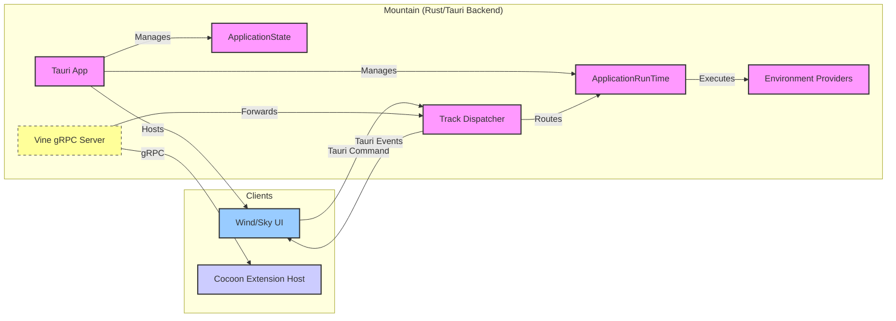

<table>
<tr>
<td align="left" valign="middle">
<h3 align="left"> Mountain</h3>
</td>
<td align="left" valign="middle">
<h3 align="left">
 ⛰️
</h3>
</td>
		<td align="left" valign="middle">
			<h3 align="left"> + </h3>
		</td>
		<td align="left" valign="middle">
			<h3 align="left">
				<a href="https://Editor.Land" target="_blank">
					<picture>
						<source media="(prefers-color-scheme: dark)" srcset="https://PlayForm.Cloud/Dark/Image/GitHub/Land.svg">
						<source media="(prefers-color-scheme: light)" srcset="https://PlayForm.Cloud/Image/GitHub/Land.svg">
						
					</picture>
				</a>
			</h3>
		</td>
		<td align="left" valign="middle">
			<h3 align="left">
				<a href="https://Editor.Land" target="_blank">
					Land
				</a>
			</h3>
		</td>
		<td align="left" valign="middle">
			<h3 align="left">
				🏞️
			</h3>
		</td>
		<td align="left" valign="middle">
			<h3 align="left"> + </h3>
		</td>
		<td align="left" valign="middle" width="190">
			<h3 align="left">
				<a href="https://Tauri.App" target="_blank">
					<picture>
						<source media="(prefers-color-scheme: dark)" srcset="https://PlayForm.Cloud/Dark/Image/GitHub/Made/Tauri.svg">
						<source media="(prefers-color-scheme: light)" srcset="https://PlayForm.Cloud/Image/GitHub/Made/Tauri.svg">
						
					</picture>
				</a>
			</h3>
		</td>
	</tr>
</table>

---

# **Mountain**&#x2001;⛰️

> **The RAM tax is not optional.** VS Code with a medium project: 500 MB to
> 1.5 GB of RAM. Three open windows means three Chromium renderer processes,
> each carrying a full heap. Every OS interaction crosses a serialized JSON IPC
> pipe.

_"Where Electron takes 200 ms to open a dialog, Mountain takes 2."_

[](https://github.com/CodeEditorLand/Mountain/tree/Current/LICENSE)
[](https://www.rust-lang.org/)&#x2001;[](https://www.rust-lang.org/)
[](https://tauri.app/)&#x2001;[](https://tauri.app/)
[](https://grpc.io/)&#x2001;[](https://github.com/hyperium/tonic)

Mountain replaces Electron's main process entirely with a Rust binary using
Tauri. The OS's own WebView renders the UI: WKWebView on macOS, WebView2 on
Windows, WebKitGTK on Linux. No bundled Chromium. No Node.js in the host
process. Window management, file system access, process lifecycle, and auth
tokens all happen in Rust with zero IPC overhead. Cold start in under 200 ms.
RAM footprint 60-80% smaller per window.

📖 **[Rust API Documentation](https://Rust.Documentation.Mountain.Editor.Land/)**

---

## What It Does&#x2001;🔐

- **No Electron overhead.** Tauri's WebView replaces three Chromium renderer
  processes. No 300 MB base memory footprint.
- **Native file I/O.** Async Rust (tokio) handles filesystem operations. File
  trees load instantly even on large monorepos.
- **Your VS Code extensions work.** Mountain manages the Cocoon sidecar over
  gRPC. Extensions run unchanged with sub-millisecond IPC.
- **Secrets stay in the OS keychain.** Authentication tokens stored via
  `keyring`, not in plaintext config files.
- **Composable business logic.** Operations expressed as declarative
  `ActionEffect`s. Testable, composable, no spaghetti callbacks.
- **Instant command dispatch.** A central `Track` dispatcher routes every UI
  action to the right provider. The UI never waits.

---

## Architecture&#x2001;🏗️

| Principle | Description | Key Components |
| :--- | :--- | :--- |
| Implementation of Contracts | Implements abstract service traits from Common | `Environment/*` providers |
| Separation of Concerns | Each domain isolated in its own provider module | `Environment/*`, `Command/*` |
| Declarative Logic | Operations as `ActionEffect`s executed by the runtime | `RunTime/*`, `Track/EffectCreation.rs` |
| Centralized State | Single thread-safe `ApplicationState` | `ApplicationState/*` |
| Typed IPC | gRPC for all Cocoon communication | `Vine/*` |
| UI-Backend Decoupling | Tauri commands and events, backend is UI-agnostic | `Binary.rs`, `Command/*` |

[Deep Dive](https://github.com/CodeEditorLand/Mountain/tree/Current/Documentation/GitHub/DeepDive.md)

---

## In the Ecosystem&#x2001;⛰️ + 🏞️



---

## Project Structure&#x2001;🗺️

```
Mountain/
├── Source/
│   ├── Binary.rs                    # Tauri entry point
│   ├── ApplicationState/            # Thread-safe state store
│   ├── Command/                     # Tauri command handlers
│   ├── Environment/                 # Common trait implementations
│   ├── ExtensionManagement/         # Extension scanning and parsing
│   ├── FileSystem/                  # Native TreeView provider
│   ├── ProcessManagement/           # Cocoon sidecar lifecycle
│   ├── RunTime/                     # Effect execution engine
│   ├── Track/                       # Central request dispatcher
│   ├── Update/                      # Self-updating logic
│   ├── Vine/                        # gRPC server/client (tonic)
│   └── Workspace/                   # .code-workspace handling
├── Proto/
│   └── Vine.proto                   # gRPC contract definition
└── build.rs                         # Proto compilation
```

---

## Development&#x2001;🛠️

Mountain is a Rust crate within the Land workspace. Follow the
[Land Repository](https://github.com/CodeEditorLand/Land) instructions to
build and run.

---

## License&#x2001;⚖️

CC0 1.0 Universal. Public domain. No restrictions.
[LICENSE](https://github.com/CodeEditorLand/Mountain/tree/Current/LICENSE)

---

## See Also

- [Mountain Documentation](https://editor.land/Doc/mountain)
- [Architecture Overview](https://editor.land/Doc/architecture)
- [Why Rust](https://editor.land/Doc/why-rust)
- [Why Tauri](https://editor.land/Doc/why-tauri)
- [Cocoon](https://github.com/CodeEditorLand/Cocoon)
- [Vine](https://github.com/CodeEditorLand/Vine)
- [Echo](https://github.com/CodeEditorLand/Echo)
- [Air](https://github.com/CodeEditorLand/Air)

## Funding & Acknowledgements&#x2001;🙏🏻

**Mountain** is a core element of the **Land** ecosystem. This project is funded
through [NGI0 Commons Fund](https://NLnet.NL/Commonsfund), a fund established by
[NLnet](https://NLnet.NL) with financial support from the European Commission's
[Next Generation Internet](https://ngi.eu) program. Learn more at the
[NLnet project page](https://NLnet.NL/project/Land).

The project is operated by PlayForm, based in Sofia, Bulgaria.

PlayForm acts as the open-source steward for Code Editor Land under the NGI0
Commons Fund grant.

<table>
	<thead>
		<tr>
			<th align="left"><strong>Land</strong></th>
			<th align="left"><strong>PlayForm</strong></th>
			<th align="left"><strong>NLnet</strong></th>
			<th align="left"><strong>NGI0 Commons Fund</strong></th>
		</tr>
	</thead>
	<tbody>
		<tr>
			<td align="left" valign="middle">
				<a href="https://Editor.Land">
					
				</a>
			</td>
			<td align="left" valign="middle">
				<a href="https://PlayForm.Cloud">
					
				</a>
			</td>
			<td align="left" valign="middle">
				<a href="https://NLnet.NL">
					
				</a>
			</td>
			<td align="left" valign="middle">
				<a href="https://NLnet.NL/commonsfund">
					
				</a>
			</td>
		</tr>
	</tbody>
</table>

---

**Project Maintainers**: Source Open
([Source/Open@Editor.Land](mailto:Source/Open@Editor.Land)) |
[GitHub Repository](https://github.com/CodeEditorLand/Mountain) |
[Report an Issue](https://github.com/CodeEditorLand/Mountain/issues) |
[Security Policy](https://github.com/CodeEditorLand/Mountain/security/policy)
