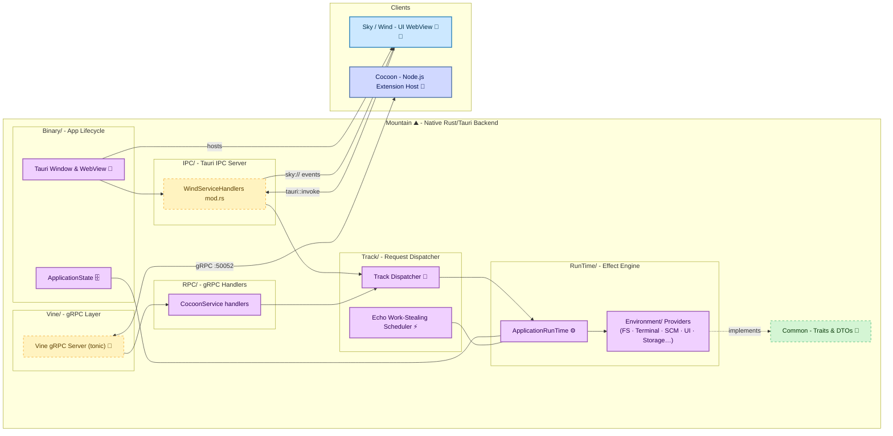

# **Mountain** 🏔️

The Bedrock of `Land`: Native Backend & Service Host.

> **The RAM tax is not optional.** `VS Code` with a medium project: 500 MB to 1.5 GB of RAM. Three open windows means three `Chromium` renderer processes, each carrying a full heap. Every OS interaction crosses a serialized JSON IPC pipe.

_"Where `Electron` takes 200 ms to open a dialog, `Mountain` takes 2."_

     

**[Rust API Documentation](https://Rust.Documentation.editor.land/Mountain/)** 📖

**Mountain** 🏔️ is the native `Rust` backend and `Tauri` application shell for the `Land` Code Editor. It serves as the foundational bedrock for the entire system, managing the application lifecycle, orchestrating native OS operations, and providing high-performance services to the `Wind` frontend and the `Cocoon` extension host.

**Mountain** 🏔️ is engineered to:

1. **Be the Native Core:** Act as the primary `Rust` application, leveraging `Tauri` to create a lightweight, cross-platform windowing and `WebView` host.
2. **Provide High-Performance Services:** Implement the abstract service `trait`s defined in the `Common` crate, offering native-speed implementations for filesystem I/O, process management, secure storage, and more.
3. **Orchestrate Sidecars:** Reliably launch, manage, and communicate with the `Cocoon` (`Node.js`) extension host sidecar via a robust `gRPC` interface.
4. **Power the User Interface:** Serve as the backend for the `Wind` layer, responding to requests via `Tauri` commands and pushing state updates via `Tauri` events.

---

## Overview

**Mountain** 🏔️ is the foundational `Rust`/`Tauri` backend for the `Land` Code Editor. It implements the abstract service `trait`s defined in the `Common` crate, providing native-speed implementations for filesystem I/O, process management, secure storage, and more. It manages the application lifecycle, orchestrates native OS operations, launches and communicates with the `Cocoon` (`Node.js`) extension host sidecar via `gRPC`, and serves as the backend for the `Wind` layer through `Tauri` commands and events. As the bedrock of the entire system, Mountain solves the problem of Electron's heavyweight architecture by delivering native performance with a fraction of the memory footprint.

### Key Features 🔐

- **Declarative Effect System:** Built on a `Rust` `ActionEffect` system defined in the `Common` crate. Business logic is described as declarative, composable effects, executed by a central `ApplicationRunTime`.
- **`gRPC`-Powered IPC:** Hosts a `tonic`-based `gRPC` server (`Vine`) to provide a strongly-typed, high-performance communication channel for the `Cocoon` extension host.
- **Centralized State Management:** Utilizes a thread-safe, `Tauri`-managed `ApplicationState` as the single source of truth for the entire application's state, from open documents to provider registrations.
- **Native PTY Management:** Implements a full-featured integrated terminal service by spawning and managing native pseudo-terminals (`PTY`) using the `portable-pty` crate.
- **Secure Storage Integration:** Leverages the native OS keychain via the `keyring` crate to securely store sensitive data like authentication tokens.
- **Robust Command Dispatching:** A central `Track` dispatcher intelligently routes all incoming requests from `Wind` and `Cocoon` to the appropriate native `Environment` provider or `ActionEffect`.

---

## Architecture

This diagram illustrates `Mountain`'s central role as the native orchestrator for the entire `Land` application.

---

## Key Components

| Component | Path | Description |
| --------- | ---- | ----------- |
| Library Entry Point | `Source/Library.rs` | Library entry point, Tauri setup. |
| LandFixTier | `Source/LandFixTier.rs` | Compile-time tier variable boot banner. |
| ApplicationState | `Source/ApplicationState/` | Thread-safe state machine with DTOs, persistence, recovery, and feature state. |
| Binary | `Source/Binary/` | Application lifecycle, Tauri command registration, initialization, shutdown. |
| Command | `Source/Command/` | Tauri command handlers grouped by domain (Keybinding, LanguageFeature, TreeView, etc.). |
| Environment | `Source/Environment/` | Concrete implementations of Common provider traits (filesystem, documents, terminal, etc.). |
| ExtensionManagement | `Source/ExtensionManagement/` | Extension discovery, manifest parsing, and VSIX installation. |
| FileSystem | `Source/FileSystem/` | Native file-explorer tree-view provider for the workspace sidebar. |
| IPC | `Source/IPC/` | Inter-process communication: Tauri IPC server, Wind service handlers, dev logging, Sky event emission. |
| ProcessManagement | `Source/ProcessManagement/` | Sidecar process lifecycle, Node.js binary resolution (nvm, fnm, asdf, volta, homebrew, shipped). |
| RPC | `Source/RPC/` | gRPC service implementations (CocoonService). |
| RunTime | `Source/RunTime/` | Effect execution engine (ApplicationRunTime, Execute, graceful Shutdown). |
| Track | `Source/Track/` | Central request dispatcher routing frontend and sidecar commands into ActionEffects. |
| Vine | `Source/Vine/` | gRPC IPC layer: server implementation and VineHost embedder trait. |
| Workspace | `Source/Workspace/` | Workspace file (.code-workspace) parsing and multi-root folder resolution. |
| Proto | `Proto/Vine.proto` | The gRPC contract definition file. |

---

## Core Architecture Principles 🏗️

| Principle | Description | Key Components |
| :------------------------------ | :-------------------------------------------------------------------------------------------------------------------------------------------- | :----------------------------------------------- |
| **Implementation of Contracts** | Implement the abstract service `trait`s from `Common`, providing concrete logic for the application's architecture. | `Environment/*` providers |
| **Separation of Concerns** | Isolate service logic into distinct `Environment` provider modules, each responsible for a specific domain (e.g., `FileSystem`, `Documents`). | `Environment/*`, `Command/*` |
| **Declarative Logic** | Express complex operations as `ActionEffect`s, executed by `ApplicationRunTime` - composable, testable, and robust. | `RunTime/*`, `Track/EffectCreation.rs`, `Common` |
| **Centralized State** | Maintain a single, thread-safe `ApplicationState` struct managed by `Tauri` for data consistency across the entire application. | `ApplicationState/*` |
| **Secure & Performant IPC** | Use `gRPC` for all communication with the `Cocoon` sidecar, ensuring a well-defined and high-performance API boundary. | `Vine/*` |
| **UI-Backend Decoupling** | Interact with `Wind` exclusively through asynchronous `Tauri` commands and events, keeping the backend UI-agnostic. | `Binary/*` (invoke handler), `Command/*` |

---

## Deep Dive & Component Breakdown 🔬

To understand how `Mountain`'s internal components are structured and how they implement the application's core logic, see [`Documentation/GitHub/DeepDive.md`](https://github.com/CodeEditorLand/Mountain/tree/Current/Documentation/GitHub/DeepDive.md). This document explains the roles of `ApplicationRunTime`, `ApplicationState`, `Handler`, `Environment`, and the `Vine` `gRPC` layer.

---

## In the Land Project

**Mountain** 🏔️ is the primary consumer of the `Common` crate and a key component in the Land monorepo. It depends on:

- **Common** — Abstract traits, DTOs, and the ActionEffect system
- **Echo** — Work-stealing scheduler for task execution

**Mountain** connects to:
- **Wind/Sky** — UI WebView via Tauri commands and events
- **Cocoon** — Node.js extension host via gRPC (port 50052, `Vine` protocol)

---

## Getting Started 🛠️

`Mountain` is a `Rust` crate and a core component of the **Land** repository. It is built as part of the monorepo. For detailed build instructions, see [`Documentation/GitHub/Building.md`](https://github.com/CodeEditorLand/Land/tree/Current/Documentation/GitHub/Building.md).

**Key Dependencies:**

| Crate / Package | Purpose |
| :--------------------- | :------------------------------------------------ |
| `Common` | Local path dependency - abstract traits & DTOs |
| `Echo` | Local path dependency - work-stealing scheduler |
| `keyring` | Secure OS keychain access |
| `log` & `env_logger` | Structured logging |
| `portable-pty` | Cross-platform native PTY for integrated terminal |
| `serde` & `serde_json` | Serialization / deserialization |
| `tauri` | `^2.x` - windowing, WebView, command dispatch |
| `tokio` | Async runtime |
| `tonic` | `gRPC` server implementation |

---

## API Reference

- [Rust API Documentation](https://Rust.Documentation.editor.land/Mountain/) 📖

---

## Related Documentation

- [Architecture Overview](https://Editor.Land/Doc/architecture) — Internal module structure
- [Deep Dive](Documentation/GitHub/DeepDive.md) — In-depth technical details
- [Land Documentation](../../Documentation/GitHub/README.md) — Complete documentation index
- [Why `Rust`](https://Editor.Land/Doc/why-rust)
- [Why `Tauri`](https://Editor.Land/Doc/why-tauri)
- [`Cocoon`](https://github.com/CodeEditorLand/Cocoon) — Extension host sidecar
- [`Vine`](https://github.com/CodeEditorLand/Vine) — gRPC protocol
- [`Echo`](https://github.com/CodeEditorLand/Echo) — Work-stealing scheduler
- [`Air`](https://github.com/CodeEditorLand/Air) — Background daemon
- [`CHANGELOG.md`](https://github.com/CodeEditorLand/Mountain/tree/Current/CHANGELOG.md) — History of changes specific to Mountain

---

## Funding

This project is funded through [NGI0 Commons Fund](https://NLnet.NL/commonsfund), a fund established by [NLnet](https://NLnet.NL) with financial support from the European Commission's Next Generation Internet program, under grant agreement No 101135429.

**Mountain** 🏔️ is a core element of the **Land** 🏞️ ecosystem. This project is funded through [NGI0 Commons Fund](https://NLnet.NL/commonsfund), a fund established by [NLnet](https://NLnet.NL) with financial support from the European Commission's [Next Generation Internet](https://ngi.eu) program. Learn more at the [NLnet project page](https://NLnet.NL/project/Land).

The project is operated by PlayForm, based in Sofia, Bulgaria. PlayForm acts as the open-source steward for Code Editor Land under the NGI0 Commons Fund grant.

| | |
| --- | --- |
|  |  |
|  |  |
